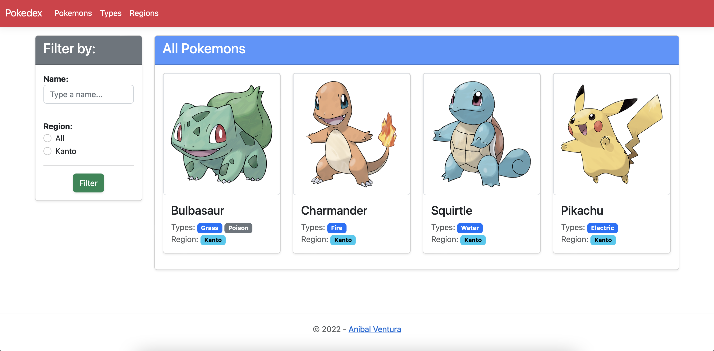
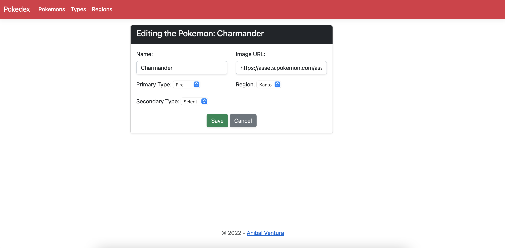

# Pokedex Web

[](https://dotnet.microsoft.com)
[](LICENCE.md)

<p align="center">
  
  
</p>

Made with ASP.NET, FluentAPI to manage a SQL database and layers architecture.

## Features

- Data persistence with SQL Server.
- Home page to see all the Pokemons created.
- Filter Pokemons in home page by name and region.
- Pokemons, Regions and Types maintenance pages to perform CRUD operations.
- Form validations.

## Technologies

- [ASP.NET](https://dotnet.microsoft.com/en-us/apps/aspnet)
- [Fluent API](https://docs.microsoft.com/en-us/ef/ef6/modeling/code-first/fluent/relationships)
- [SQL Server](https://www.microsoft.com/en-us/sql-server/sql-server-downloads)
- [Bootstrap](https://getbootstrap.com)


## Dependencies

- [Microsoft.AspNetCore.Mvc.Razor.RuntimeCompilation - Version 5.0.17](https://www.nuget.org/packages/Microsoft.AspNetCore.Mvc.Razor.RuntimeCompilation)
- [Microsoft.EntityFrameworkCore.Design - Version 5.0.17](https://www.nuget.org/packages/Microsoft.EntityFrameworkCore.Design)
- [Microsoft.EntityFrameworkCore.SqlServer - Version 5.0.17](https://www.nuget.org/packages/Microsoft.EntityFrameworkCore.SqlServer)
- [Microsoft.EntityFrameworkCore.Tools - Version 5.0.17](https://www.nuget.org/packages/Microsoft.EntityFrameworkCore.Tools)
- [Microsoft.EntityFrameworkCore.Relational - Version 5.0.17](https://www.nuget.org/packages/Microsoft.EntityFrameworkCore.Relational)

## Build

1. Create a SQL Server database.

2. Open solution in [Visual Studio](https://visualstudio.microsoft.com) and edit the `ConnectionStrings` section on `appsettings.json` in `PokedexWebApp` layer.

```json
"ConnectionStrings": {
    "DefaultConnection": "Server=localhost,PortNumber;Database=DatabaseName;User=DatabaseUser;Password=DatabasePassword;Trusted_Connection=false;MultipleActiveResultSets=true"
  }
```

3. Run migrations.

* On Windows: Open `Package Console` and run:
```
Add-Migration "First migration"
Update-Database
```

- On Linux/MacOS: Install [.NET Core CLI tools](https://docs.microsoft.com/en-us/ef/core/get-started/overview/install#get-the-net-core-cli-tools) and run in terminal:
```
dotnet ef --startup-project ./PokedexWebApp/ migrations add Initial
dotnet ef --startup-project ./PokedexWebApp/ database update
```

4. Run the project.


## License

```xml
MIT License

Copyright (c) 2022 Anibal Ventura
```
